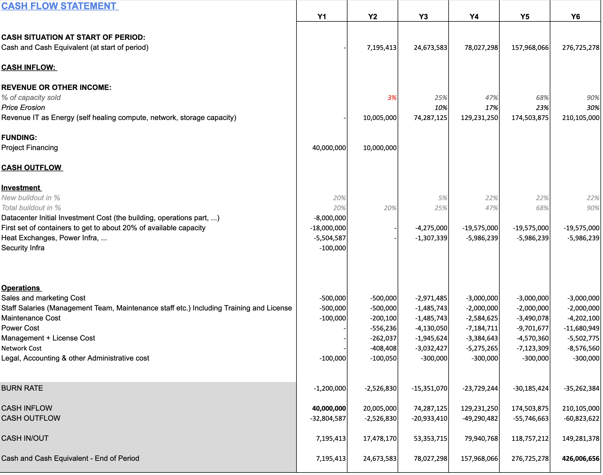
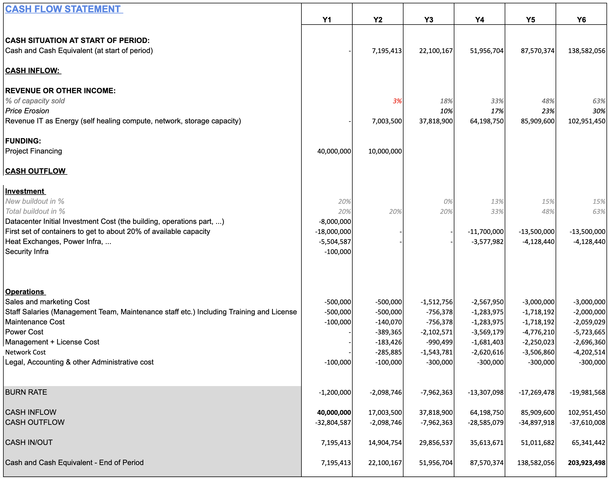

# Cashflow No Solar

## normal case

A Tier-S datacenter is much more profitable compared to a Tier-3 Datacenter as can be seen in next cash flow overview.

In next simulation we used the following params

- 100% occupation after 6 years
- price erosion of 30% (means products getting cheaper)
- we invest 40m USD at start
- this results in a potential multiple of 10x

This model shows how the generated cashflow is enough to purchase the required expansions.

## 70% case

In case we lower the business case

- 70% occupation only after 6 years

Still returns a multiple of 5x

## 70% case

In case we lower the business case

70% occupation after 6 years still returns a multiple of 5x

## 45% case

Only 45% occupation after 6 years still is able to return money.

Still returns 2.5x

## the absolute worst case of 25% case

- still enough to return the money

> more info about these datacenters see: [https://info.ourworld.tf/datacenter](https://info.ourworld.tf/datacenter)

> the detailed calculator [can be found here](https://docs.google.com/spreadsheets/d/1HXIiLSbuEE7bfg9grD9Fs2I56MmE-zBCi_2FzUuQOiQ/edit)