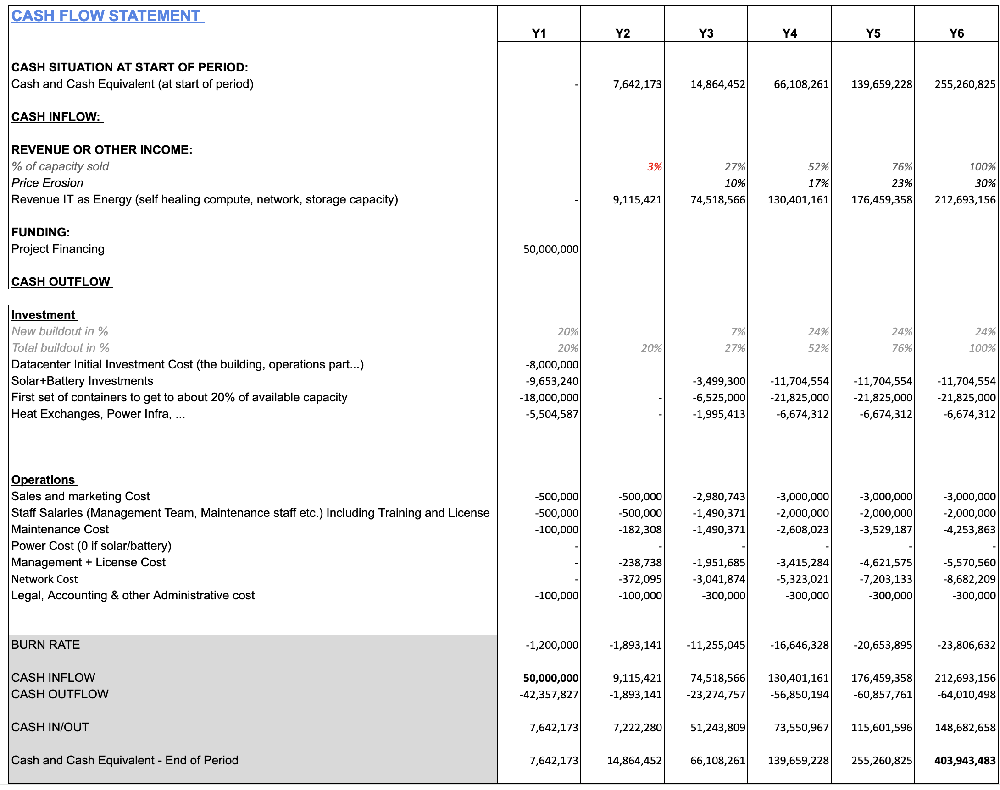

# Cashflow Green Energy

A Tier-S datacenter is probably the only type of datacenter which is capable to be powered by solar and batteries.

## 100% case

The parameters:

- 100% occupation after 6 years
- price erosion of 30% (means products getting cheaper)
- we invest 50m USD at start
- this results in a potential multiple of 8x

This model shows how the generated cashflow is enough to purchase the required expansions even for buying solar and batteries.

> We write off the solar, batteries and datacenter on only 6 years, which is too fast, in reality the case will be better and we will be able to use the infrastructure longer.

## 70% case

In case we lower the business case to only 70% only after 6 years we still returns a multiple of 3.5 times.

## conclusion on solar.

The only downside of solar is that we need 10m USD more as base investment.

> more info about these datacenters see: [https://info.ourworld.tf/datacenter](https://info.ourworld.tf/datacenter)

> the detailed calculator [can be found here](https://docs.google.com/spreadsheets/d/1HXIiLSbuEE7bfg9grD9Fs2I56MmE-zBCi_2FzUuQOiQ/edit)