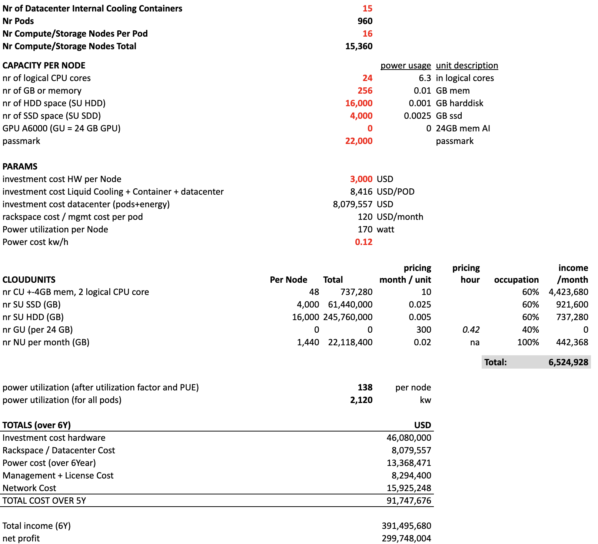

# Standard Pods

This is a simulation for 15 containers with 960 pods which can be used for generic workloads.

Each node cost 3000 USD and has a lot of compute, storage capabilities. The nodes are submerged in liquid oil and as such more protected, need less power and will also last much longer.

The investment needed for this amount of pods is 46m USD, important is that this investment only needs to be done as customers come on board. The upfront is low, we can start with 1 container with e.g. 32 pods and grow from there, this benefits the risk profile and cash need.

The pricing used is 2-4x more cost effective than prices as used on the market today, see the pricing sheet.