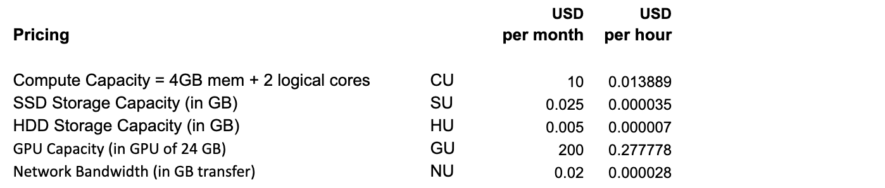
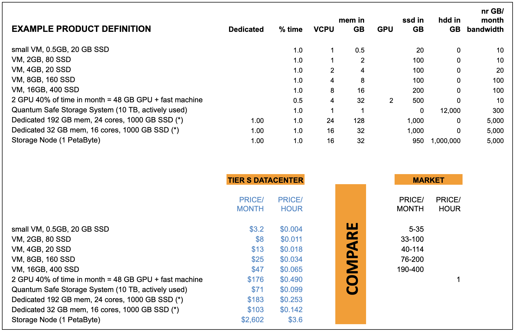

# Pricing Check

The pricing as used is based on the raw capacity of solutions running inside the Tier S datacenter, each solution will use a certain amount of compute, storage, gpu and network capacity. This is a very flexible model and allows customers to scale immediately up and down.

The price is depending on period committed though (pricing above is for min 1 month, appart from when mentioned per hour).

## Price Comparison

To compare pricing see [https://www.cloudorado.com](https://www.cloudorado.com), which is a pricing aggregator site.

We simulated some product offerings and compared the outcome to market:

This shows how the pricing as used is very competive and should not be an issue to sell the capacity.